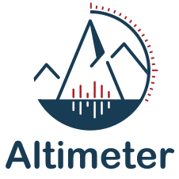

<p align="center">
  
</p>

This repository contains the model and training code for Altimeter - a transformer model for peptide spectrum prediction.

## Dataset

The training data is available from Zenodo: https://zenodo.org/records/15875054

Download and unpack the archive into a working directory, e.g. `~/altimeter_data`:

```bash
wget https://zenodo.org/records/15875054/files/altimeter_data.zip?download=1 -O altimeter_data.zip
unzip altimeter_data.zip -d ~/altimeter_data
```

After extraction, update `config/data.yaml` so the paths point to your dataset location:

```yaml
base_path: /path/to/altimeter_data/
ion_dictionary_path: /path/to/altimeter_data/saved_model/ion_dictionary.txt
dataset_path: datasets/
position_path: txt_pos/
label_path: labels/
saved_model_path: saved_model/
```

## Weights & Biases

The training script logs metrics to [Weights & Biases](https://wandb.ai/).

1. Create an account and obtain an API key.
2. Authenticate once on the command line:
   ```bash
   wandb login
   ```
   or set `WANDB_API_KEY` in your environment.
3. The default project name is `Altimeter`. Override it with the
   `WANDB_PROJECT` environment variable or by editing `altimeter/train.py`.
4. To run without logging, set `WANDB_MODE=offline`.

## Training

### Using Docker

```bash
docker pull dennisgoldfarb/pytorch_ris:lightning
docker run --gpus all -v $PWD:/workspace/Altimeter \
    -v /path/to/altimeter_data:/data \
    dennisgoldfarb/pytorch_ris:lightning \
    python altimeter/train.py config/data.yaml
```

### Without Docker

Create a Python environment with PyTorch, PyTorch Lightning, and the
repository's dependencies, then run:

```bash
python altimeter/train.py config/data.yaml
```
